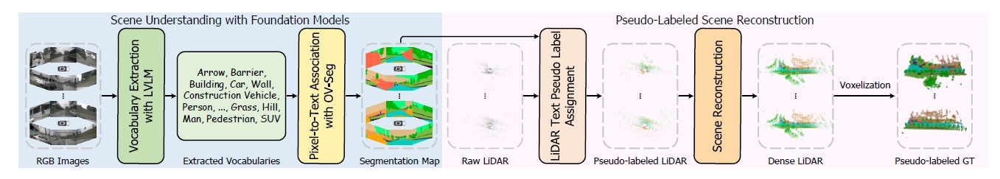
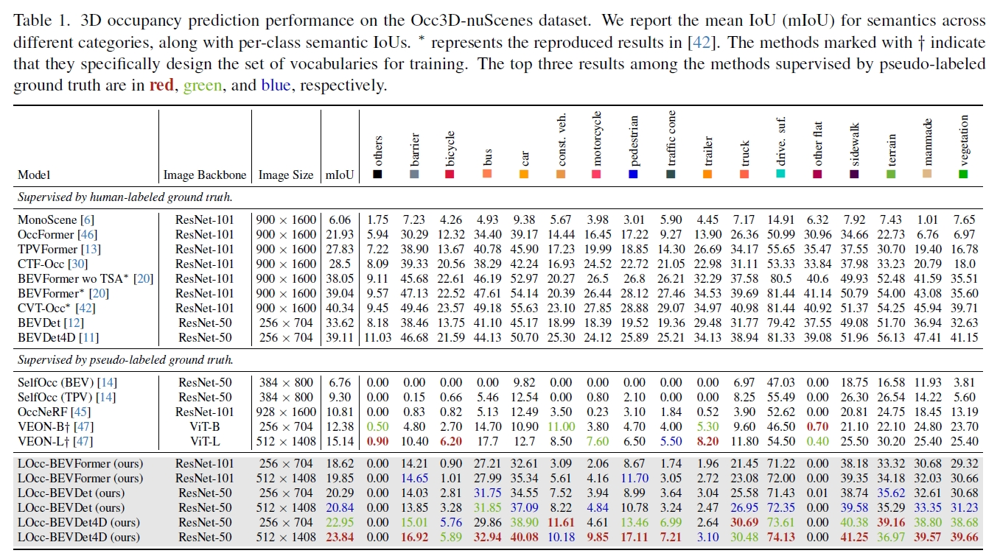

# Language Driven Occupancy Prediction

## News

- **2024.12.21** Code released
- **2024.11.26** [**arXiv**](https://arxiv.org/pdf/2411.16072v1) preprint released
- **2024.11.25** Repo initialized

## Introduction

We introduce LOcc, an effective and generalizable framework for open-vocabulary occupancy (OVO) prediction. Previous approaches typically supervise the networks through coarse voxel-to-text correspondences via image features as intermediates or noisy and sparse correspondences from voxel-based model-view projections. To alleviate the inaccurate supervision, we propose a semantic transitive labeling pipeline to generate dense and fine-grained 3D language occupancy ground truth. Our pipeline presents a feasible way to dig into the valuable semantic information of images, transferring text labels from images to LiDAR point clouds and ultimately to voxels, to establish precise voxel-to-text correspondences. By replacing the original prediction head of supervised occupancy models with a geometry head for binary occupancy states and a language head for language features, LOcc effectively uses the generated language ground truth to guide the learning of 3D language volume. Through extensive experiments, we demonstrate that our semantic transitive labeling pipeline can produce more accurate pseudo-labeled ground truth, diminishing labor-intensive human annotations. Additionally, we validate LOcc across various architectures, where all models consistently outperform state-of-the-art zero-shot occupancy prediction approaches on the Occ3D-nuScenes dataset. Notably, even based on the simpler BEVDet model, with an input resolution of $\text{256}\times\text{704}$, LOcc-BEVDet achieves an mIoU of 20.29, surpassing previous approaches that rely on temporal images, higher-resolution inputs, or larger backbone networks. The code for the proposed method is available.

## Method



Framework of our semantic transitive labeling pipeline for generating dense and fine-grained pseudo-labeled 3D language occupancy ground truth. Given surround images of the entire scene, we first map them to a vocabulary set using a large vision-language model (LVLM) and associate pixels with these terms through an open-vocabulary segmentation model (OV-Seg). Based on the segmentation results, we assign pseudo labels to the points by projecting them onto the corresponding image plane and merge all the point clouds to form a complete scene. Finally, we voxelize the scene reconstruction results to establish dense and fine-grained voxel-to-text correspondences, generating the pseudo-labeled ground truth.

## Quantitative Results



## Getting Started
step 1. Please refer to [dataset](./docs/dataset.md) to prepare the nuScenes-Occ3d dataset.

step 2. Please refer to [LVLM](./1-LVLM/LVLM.md) to perform vocabulary extraction with LVLM.

step 3. Please refer to [OVSeg](./2-OVSeg/OVSeg.md) to establish pixel-to-text association.

step 4. Please refer to [GroundTruthGeneration](./3-GroundTruthGeneration/GroundTruthGeneration.md) to generate dense and fine-grained pseudo-labeled 3D language occupancy ground truth.

step 5. Please refer to [Autoencoder](./4-Autoencoder/Autoencoder.md) to map the language features into a low-dimensional latent space.

step 6. Please refer to [OVO](./5-OVO/OVO.md) for open vocabulary occupancy prediction with BEVDet and BEVFormer.
## Acknowledgement

Many thanks to these exceptional open source projects:

- [BEVFormer](https://github.com/fundamentalvision/BEVFormer)
- [mmdet3d](https://github.com/open-mmlab/mmdetection3d)
- [BEVDet](https://github.com/HuangJunJie2017/BEVDet)
- [SurroundOcc](https://github.com/weiyithu/SurroundOcc)

## Bibtex
If you find our work beneficial for your research, please consider citing our paper and give us a star:
```shell
@article{LOcc,
  title={Language Driven Occupancy Prediction},
  author={Yu, Zhu and Pang, Bowen and Liu, Lizhe and Zhang, Runmin and Peng, Qihao and Luo, Maochun and Yang, Sheng and Chen, Mingxia and Cao, Si-Yuan and Shen, Hui-Liang},
  journal={arXiv preprint arXiv:2411.16072},
  year={2024}
}
```
If you encounter any issues, please contact zhu.yu.pk@gmail.com.

## To Do

- Getting started
- Model zoo